# GardenHub

GardenHub is a comprehensive **gardening platform** built with React and Node.js that connects gardening enthusiasts, experts, and plant lovers in one vibrant community. The platform allows users to browse gardening tips, explore plant care guides, share their gardening experiences, get expert advice, and connect with fellow gardeners. With features like user authentication, dynamic content management, and interactive community features, GardenHub makes gardening knowledge accessible and gardening communities thrive.

## 🚀 Live Demo

A live demo of the project can be found [here on Netlify](https://garden-hub-by-rakib.netlify.app/) & [here on Surge](http://garden-hub-by-rakib.surge.sh).

---

## 📸 Screenshots

To know better about our project:

* **Home Page**: 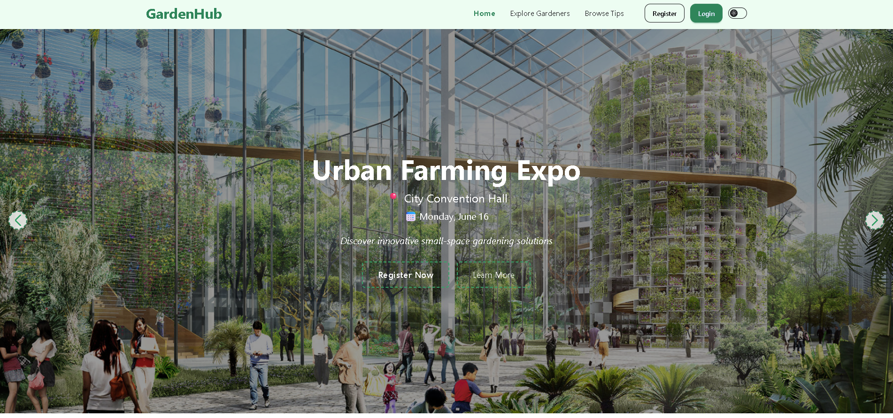
* **Browse Tips Page**: 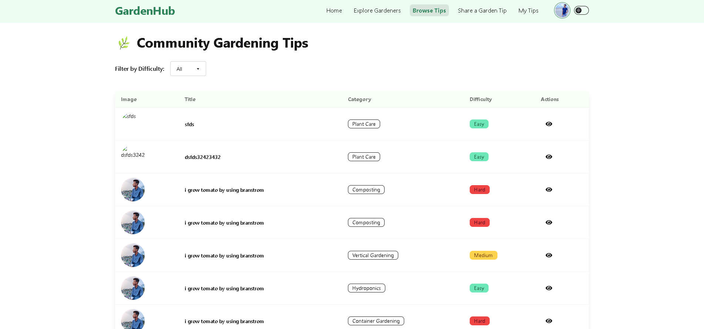
* **Edit Profile Page**: 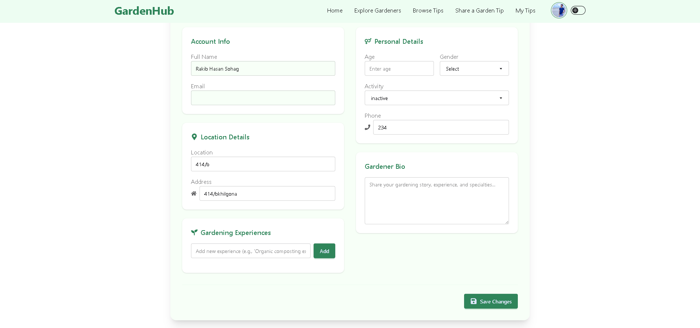
* **Explore Gardeners Page**: 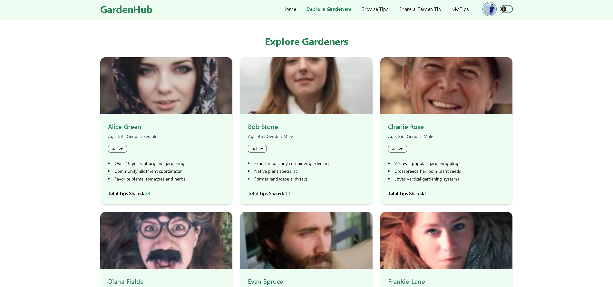
* **Forgot Password Page**: 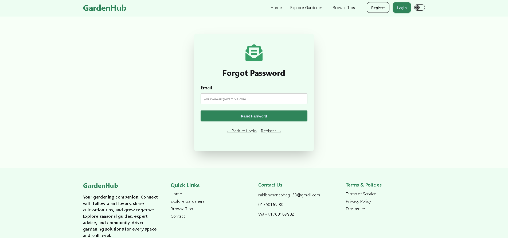
* **Login Page**: 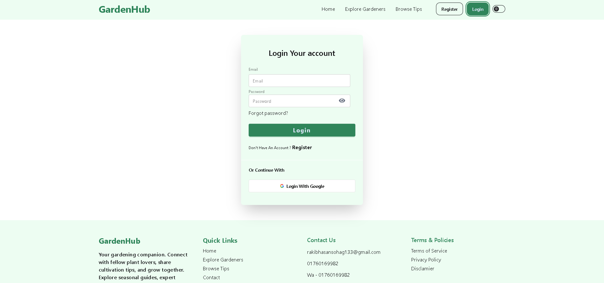
* **My Tips Page**: 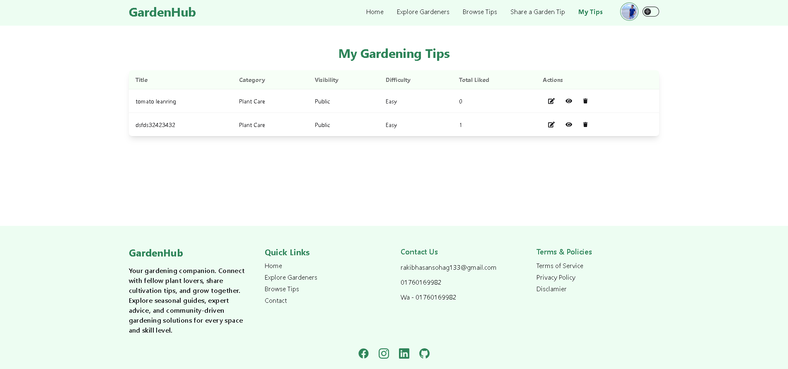
* **Not Found Page**: 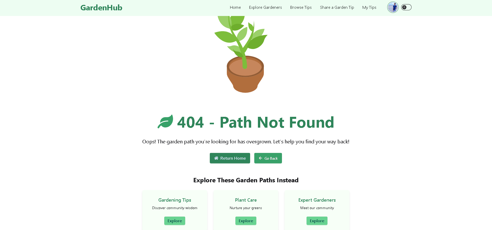
* **Profile Page**: 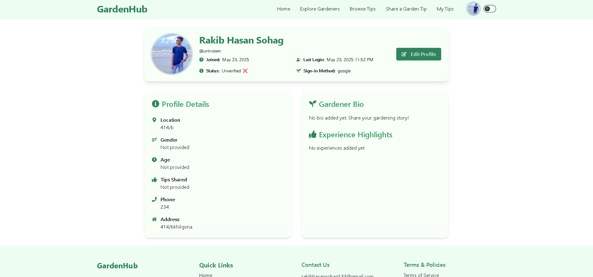
* **Register Page**: 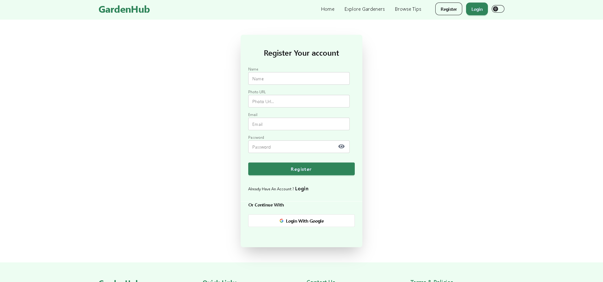
* **Sharing Tips Page**: 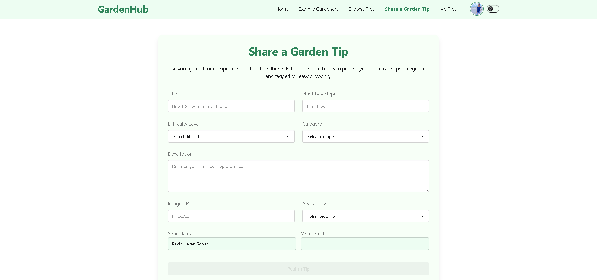
* **Tips Details Page**: 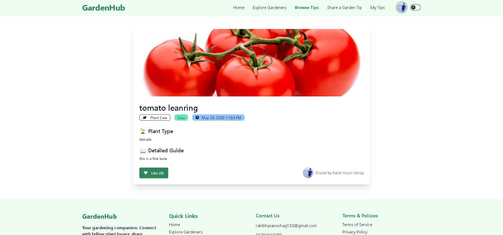
* **Tips Not Found Page**: 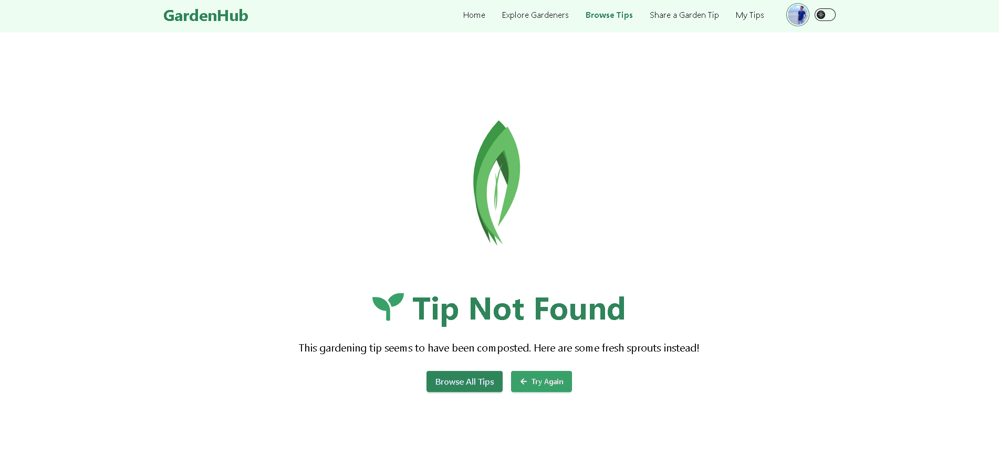

---

## ✨ Features

* 🌱 **Browse Gardening Tips**: Explore a vast collection of gardening tips and plant care guides from the community.
* 🔍 **Advanced Search & Filter**: Find specific gardening advice with powerful search and filtering options.
* 📝 **Share Your Knowledge**: Create and share your own gardening tips with detailed descriptions and images.
* 👥 **Community Connection**: Explore profiles of fellow gardeners and learn from their experiences.
* 💬 **Expert Advice**: Get guidance from experienced gardeners and horticulture experts.
* 🔐 **Secure Authentication**: Firebase Authentication with email/password and social login options.
* 🛡️ **Protected Routes**: Secure user areas for profile management and content creation.
* 👤 **User Profiles**: Personalized profiles with gardening interests, experience level, and shared content.
* 🔑 **Password Recovery**: Easy password reset functionality for account security.
* 🎭 **Smooth Animations**: Beautiful transitions and interactions powered by Motion (Framer Motion).
* ⚡ **Fast Loading**: Optimized with lazy loading and efficient data fetching.
* 📱 **Mobile Responsive**: Fully responsive design that works seamlessly on all devices.
* 🎨 **Modern UI/UX**: Clean, intuitive interface built with Tailwind CSS and DaisyUI.
* 📊 **Dynamic Content**: Real-time updates and dynamic content management.
* 🔄 **Interactive Elements**: Engaging tooltips, modals, and interactive components.

---

## 🛠️ Tech Stack

### Frontend
* **React 19** – Modern UI library with latest features.
* **React Router 7** – Advanced client-side routing.
* **Tailwind CSS 4** – Utility-first CSS framework.
* **DaisyUI** – Beautiful Tailwind component library.
* **Motion** – Powerful animation library (formerly Framer Motion).
* **Firebase Auth** – Secure authentication system.
* **Vite** – Lightning-fast build tool.
* **SweetAlert2** – Beautiful alert modals.
* **React Tooltip** – Interactive tooltips.
* **React Icons** – Comprehensive icon library.
* **Swiper** – Modern touch slider.
* **Lottie React** – High-quality animations.
* **Moment.js** – Date and time formatting.

### Backend
* **Node.js** – JavaScript runtime environment.
* **Express.js** – Fast web application framework.
* **MongoDB** – NoSQL database for flexible data storage.
* **CORS** – Cross-origin resource sharing.
* **dotenv** – Environment variable management.

---

## 📦 Installation

### Client Setup

1. **Clone the client repository**:
   ```bash
   git clone https://github.com/rakibhasansohag/GardenHub-client
   cd GardenHub-client
   ```

2. **Install dependencies**:
   ```bash
   npm install
   # or yarn install
   ```

3. **Set up environment variables**:
   * Create a `.env` file in the project root.
   * Add your Firebase config:
     ```env
     VITE_FIREBASE_API_KEY=YOUR_API_KEY
     VITE_FIREBASE_AUTH_DOMAIN=YOUR_PROJECT_ID.firebaseapp.com
     VITE_FIREBASE_PROJECT_ID=YOUR_PROJECT_ID
     VITE_FIREBASE_STORAGE_BUCKET=YOUR_PROJECT_ID.appspot.com
     VITE_FIREBASE_MESSAGING_SENDER_ID=YOUR_MESSAGING_SENDER_ID
     VITE_FIREBASE_APP_ID=YOUR_APP_ID
     ```

4. **Start the development server**:
   ```bash
   npm run dev
   # or yarn dev
   ```

### Server Setup

1. **Clone the server repository**:
   ```bash
   git clone https://github.com/rakibhasansohag/GardenHub-Server
   cd GardenHub-Server
   ```

2. **Install dependencies**:
   ```bash
   npm install
   ```

3. **Set up environment variables**:
   * Create a `.env` file in the project root.
   * Add your configuration:
     ```env
     PORT=5000
     MONGODB_URI=YOUR_MONGODB_CONNECTION_STRING
     NODE_ENV=development
     ```

4. **Start the server**:
   ```bash
   npm run dev
   # or npm start for production
   ```

Your client app should be running at `http://localhost:5173` and your server at `http://localhost:5000`.

---

## 🚀 Deployment

### Client Deployment

**Netlify**:
1. Push your code to GitHub.
2. Connect your repo to Netlify and set build command `npm run build`.
3. Add the same environment variables in Netlify's dashboard.

**Surge**:
1. Install Surge globally: `npm install -g surge`
2. Build the app: `npm run build`
3. Deploy: `surge ./dist`

### Server Deployment
Deploy your Node.js server to platforms like Heroku, Railway, or Vercel, ensuring environment variables are properly configured.

---

## 📁 Project Structure

### Client Structure
```
client/
├── public/              # Static assets and images
├── src/
│   ├── assets/          # Images and static files
│   ├── components/      # Reusable UI components
│   │   ├── BlogSection.jsx
│   │   ├── Footer.jsx
│   │   ├── Gardeners.jsx
│   │   ├── Header.jsx
│   │   ├── Hero.jsx
│   │   ├── Loading.jsx
│   │   ├── Navbar.jsx
│   │   ├── Table.jsx
│   │   ├── Testimonials.jsx
│   │   └── TopHandTips.jsx
│   ├── context/         # Context providers
│   │   ├── AuthContext.jsx
│   │   └── AuthProvider.jsx
│   ├── firebase/        # Firebase configuration
│   ├── layouts/         # Layout components
│   │   └── MainLayout.jsx
│   ├── lib/             # Utility functions
│   │   └── utils.jsx
│   ├── pages/           # Route components
│   │   ├── BrowseTips.jsx
│   │   ├── EditProfilePage.jsx
│   │   ├── ExploreGardeners.jsx
│   │   ├── ForgotPassword.jsx
│   │   ├── Home.jsx
│   │   ├── Login.jsx
│   │   ├── MyTips.jsx
│   │   ├── NotFound.jsx
│   │   ├── ProfilePage.jsx
│   │   ├── Register.jsx
│   │   ├── SharingTips.jsx
│   │   ├── TipsDetails.jsx
│   │   └── TipsNotFound.jsx
│   ├── App.jsx
│   └── main.jsx
├── .gitignore
├── package.json
└── README.md
```

### Server Structure
```
server/
├── node_modules/        # Dependencies
├── .env                 # Environment variables
├── .gitignore
├── index.js            # Main server file
├── package.json
├── vercel.json
└── sample.env
```

---

## 🤝 Contributing

Contributions are welcome! Feel free to open an issue or submit a pull request to help improve GardenHub and make it even more useful for the gardening community.

---

## 👨‍💻 Author

**Rakib Hasan Sohag**
- GitHub: [@rakibhasansohag](https://github.com/rakibhasansohag)

---

*This project is for learning purposes and aims to create a thriving community for gardening enthusiasts worldwide.*